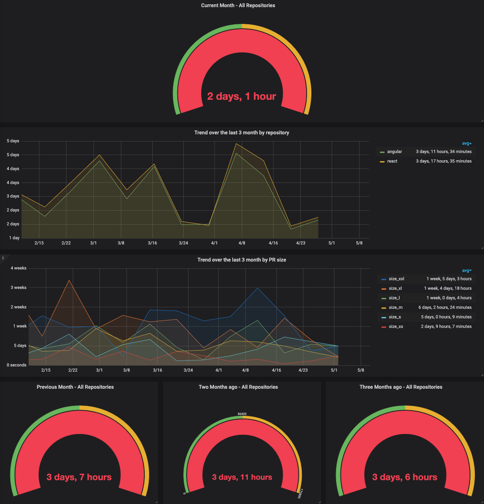

[](https://travis-ci.org/matchilling/github-metrics-graphite-exporter)

# Github PR Metrics Graphite Exporter

[](./data/github-pr-metrics.png)

This exporter converts raw GitHub pull request data to time series. The exported data points represent the number of seconds (⏰ business hours only, Mon-Fri 09:00 - 17:00) elapsed between the creation of the pull request and the merging of the pull request.

The timestamp is the creation time of the PR.

Exposed metrics name: `github.{USER_NAME}.{REPO_NAME}.pull_requests.time_to_merge`

## Usage

```sh
$ npm install

# At the moment the user name & repo name are only used to build up the metrics path
$ export USER_NAME=github-user-name
$ export REPO_NAME=repository-name

# Path to the SQLite db file containing the PR data retrieved from GitHub.
$ export PULL_REQUESTS_DATABASE_PATH=data/example.db

# Push data to graphite
$ npm start | nc localhost 2003

# The generated time series will be written to `stdout`.
# github.github-user-name.repository-name.pull_requests.time_to_merge 3450 1554125772
# github.github-user-name.repository-name.pull_requests.time_to_merge 935617 1553187544
# ...
```

## Todo

- [x] Exclude non-business hours from calculation
- [ ] Exclude public holidays from calculation
